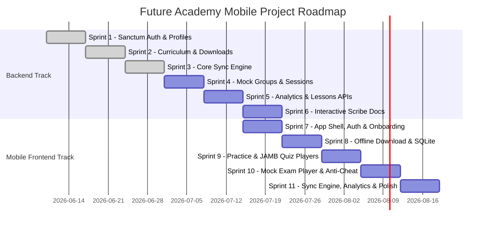

# Future Academy: Mobile Integration Project Roadmap

This document outlines the professional milestone roadmap to share with your client. It covers **two parallel tracks** — the **Laravel API backend** (Sprints 1–5) and the **Expo mobile frontend** (Sprints 6–10) — broken into concrete weekly sprints with testable deliverables.

---

## 📅 Milestone Breakdown

---

## 🔵 BACKEND TRACK — Sprints 1–5

### ✅ Milestone 1: API Security & Authentication (Week 1) — COMPLETE
Establish the secure foundation for the mobile app connection.
*   **Tasks**:
    *   Configure Laravel Sanctum middleware for bearer-token auth.
    *   Create `AuthController` for issuing mobile access tokens.
    *   Build the `GET /api/v1/user` profile endpoint.
    *   Write feature tests to verify login authentication, validation errors, and invalid token denials.
*   **Client Deliverable**:
    *   API routes working with Postman token storage.
    *   Passing Pest test suite logs showing successful secure access (`tests/Feature/Api/AuthApiTest.php`).

---

### ✅ Milestone 2: Question Pack Downloader APIs (Week 2) — COMPLETE
Provide the data payloads required for the mobile app's offline features.
*   **Tasks**:
    *   Create `SubjectDownloadController`.
    *   Implement single-subject question package download endpoint, integrating optional year parameters.
    *   Implement multi-subject **JAMB Practice** download endpoint, packaging the exact 4-subject layouts.
    *   Optimize SQL queries to prevent N+1 issues when loading question options.
*   **Client Deliverable**:
    *   Endpoints returning question packages of varying sizes (by year or all-years combined) with execution speeds under 500ms.
    *   Passing tests (`tests/Feature/Api/SubjectDownloadApiTest.php`).

---

### ✅ Milestone 3: Core Offline Sync Engine (Week 3) — COMPLETE
Build the system that processes offline student progress once they reconnect.
*   **Tasks**:
    *   Create `SyncController` with transaction checks.
    *   Build batch handler to insert offline quiz attempts, processing individual question answers and updating metrics.
    *   Build video watch-time and completion progress synchronizer.
    *   Write edge-case tests to handle network disconnect retries and prevent double-grading attempts.
*   **Client Deliverable**:
    *   Database records automatically updating on the admin panel after a single simulated batch request is sent from Postman.
    *   Passing tests (`tests/Feature/Api/SyncApiTest.php`).

---

### ✅ Milestone 4: Mock Exam Batches & Sessions (Week 4) — COMPLETE
Deliver the exam environment backend backing timed tests and mock setups.
*   **Tasks**:
    *   Create `MockExamController`. ✅
    *   Implement single-subject **Mock Group (batch)** selection and download endpoints. ✅
    *   Implement multi-subject **Mock Session** initialization, returning dynamic subject configurations and time limits. ✅
    *   Integrate mock attempt sync validation inside database transaction layers. ✅
*   **Client Deliverable**:
    *   Working API workflows showing students starting a multi-subject Mock Session and submitting scores securely. ✅

---

### ✅ Milestone 5: Analytics, Lessons & Configuration APIs (Week 5) — COMPLETE
Provide the data APIs needed for dashboard, analytics, and lesson features.
*   **Tasks**:
    *   Create `AnalyticsController` for user stats, subject performance, quiz history. ✅
    *   Create `LessonController` for lessons list, video progress, completion tracking. ✅
    *   Create `ConfigurationController` for subjects list, exam types, years, mock formats. ✅
    *   Create `QuizController` for quiz list, start quiz, submit answers, results. ✅
    *   Write tests for all new endpoints. ✅
*   **Client Deliverable**:
    *   All analytics and dashboard data available via API. ✅
    *   Lessons accessible via API with video URLs and progress tracking. ✅
    *   Configuration data for mobile app setup. ✅

### 🟡 Milestone 6: Interactive Scribe Documentation & Handover (Week 6) — PENDING
Provide the final, interactive manuals so the client's mobile developers can link the app instantly.
*   **Tasks**:
    *   Install and configure **Laravel Scribe**.
    *   Annotate all mobile routes and controller methods with PHPDoc `@group`, `@bodyParam`, `@response` tags.
    *   Use existing database content so Scribe response calls can use real database-backed example data.
    *   Compile Scribe to build the interactive HTML documentation.
    *   Export the fully validated Postman library (`collection.json`).
*   **Client Deliverable**:
    *   A Stripe-style interactive API documentation webpage hosted on the staging server, complete with a "Try it out" feature and download link for the Postman collection.

---

## 📱 MOBILE FRONTEND TRACK — Sprints 7–11

> **Tech Stack**: Expo (React Native) + TypeScript + Expo Router + NativeWind (Tailwind CSS) + expo-sqlite + TanStack Query

---

### 🟡 Milestone 7: App Shell, Navigation, Authentication & Onboarding Screens (Week 7)
Build the foundational app structure, user authentication, and onboarding setups.
*   **Tasks**:
    *   Scaffold the Expo project with Expo Router file-based navigation.
    *   Build the `(auth)/login.tsx` screen with email/password form and device name capture.
    *   Integrate the `POST /api/v1/login` endpoint — store token securely with `expo-secure-store`.
    *   Build the **Onboarding Flow screen** (`(auth)/onboarding.tsx`): select stream (Science, Arts, Social Sciences) or manually pick subjects, saving selection via configuration API.
    *   Implement token-based route protection and onboarding checks (redirect unauthenticated users to login, and authenticated but non-onboarded users to onboarding).
    *   Build the `(tabs)` shell: Home/Dashboard, Practice, JAMB, Mock, Settings tabs with placeholder screens.
    *   Build the Settings screen with Logout button (calls `POST /api/v1/logout`).
*   **Client Deliverable**:
    *   APK shared via WhatsApp that a student can install, log in with real credentials, complete the stream selection onboarding, and see the main tab navigation.

---

### 🟡 Milestone 8: Offline Download Manager & Local SQLite Database (Week 8)
Enable the app to download and store question packs for fully offline use.
*   **Tasks**:
    *   Set up local SQLite database schema on app start using `expo-sqlite` (`questions`, `options`, `offline_attempts`, `offline_answers` tables).
    *   Build the **Subject Index screen** (`(tabs)/index.tsx`) that lists enrolled subjects from `GET /api/v1/subjects`.
    *   Build the **Download Manager**: progress indicator, per-subject download button, download size preview.
    *   Implement `GET /api/v1/subjects/{id}/download` data fetch and persist the questions/options into local SQLite.
    *   Add download status (Downloaded / Not Downloaded / Outdated) indicators per subject.
    *   Handle download failures gracefully with retry logic and offline detection via `@react-native-community/netinfo`.
*   **Client Deliverable**:
    *   Student can download a full subject question bank in under 2 seconds on 4G, with the data visible in the app even in airplane mode.

---

### 🟡 Milestone 9: Practice Quiz & JAMB Quiz Players (Week 9)
Deliver the two core study modes with a fully working offline quiz experience.
*   **Tasks**:
    *   Build **Practice Setup screen** (`(tabs)/practice-setup.tsx`): subject selector, optional year filter, question count slider.
    *   Build **Single-Subject Quiz Player** (`practice/single-quiz.tsx`):
        *   Load questions from local SQLite.
        *   Question navigator, option selection, answer reveal with explanation.
        *   Progress bar and question counter.
        *   Record answers into `offline_answers` table.
        *   On completion, write a completed attempt to `offline_attempts`.
    *   Build **JAMB Setup screen** (`(tabs)/jamb-setup.tsx`): 4-subject picker with year filter.
    *   Build **JAMB Quiz Player** (`practice/jamb-quiz.tsx`):
        *   Subject tab switcher (Mathematics | English | Biology | Chemistry).
        *   Per-subject question navigation.
        *   Shared timer across all subjects.
*   **Client Deliverable**:
    *   Student can complete a full 40-question JAMB practice session offline and see their score on the results screen.

---

### 🟡 Milestone 10: Mock Exam Player & Anti-Cheat Timer (Week 10)
Deliver the timed, invigilated exam experience.
*   **Tasks**:
    *   Build **Mock Setup screen** (`(tabs)/mock-setup.tsx`): single vs. multi-subject toggle, subject picker.
    *   Build **Mock Groups screen** (`(tabs)/mock-groups.tsx`): list available batches from `GET /api/v1/mock/groups`.
    *   Build **Mock Quiz Player** (`mock/mock-quiz.tsx`):
        *   Countdown timer (visible, auto-submits on expiry).
        *   Lock questions after submission — no changes allowed.
        *   Anti-cheat: detect app backgrounding and log violations.
        *   Store completed attempt in `offline_attempts` with `mock_group_id`.
    *   Call `POST /api/v1/mock/sessions` for multi-subject mock initialization.
    *   Display per-subject score breakdown on the results screen.
*   **Client Deliverable**:
    *   Student can start and complete a timed 2-hour multi-subject mock exam. The timer auto-submits and scores are shown instantly.

---

### 🟡 Milestone 11: Background Sync Engine, Video Lessons, Analytics & App Polish (Week 11)
Connect all offline data back to the server, display streaks/analytics, and finalize the production-ready app.
*   **Tasks**:
    *   Build the **Sync Engine**: on app resume or Wi-Fi connection, batch-upload all unsynced `offline_attempts` and `offline_answers` to `POST /api/v1/sync`.
    *   Show sync status indicator ("3 attempts pending sync" / "All synced ✓").
    *   Build **Video Lessons screen** (`lessons/video.tsx`): fetch Bunny CDN token from `GET /api/v1/lessons/{id}/video-token` and play securely.
    *   Implement **Dashboard Analytics & Study Streaks**:
        *   Fetch and display the study streak from `GET /api/v1/analytics/study-streak`.
        *   Fetch and display detailed subject performance analytics from `GET /api/v1/analytics/subject-performance`.
        *   Integrate overall quiz statistics and progress tracking.
    *   Implement **crash reporting** with Sentry and **analytics** with Firebase.
    *   Performance pass: skeleton loading screens, image lazy-loading, pull-to-refresh.
    *   Final EAS production build and Play Store submission checklist.
*   **Client Deliverable**:
    *   Full end-to-end flow: student completes offline mock, phone reconnects to data, scores appear in the admin Filament panel automatically. Production APK ready for Play Store submission.
